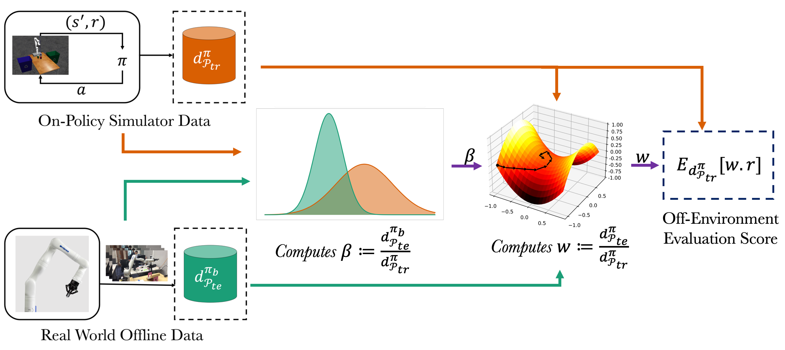
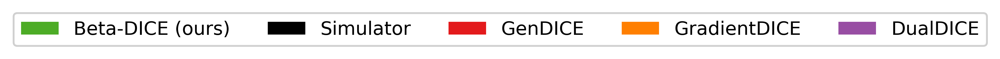
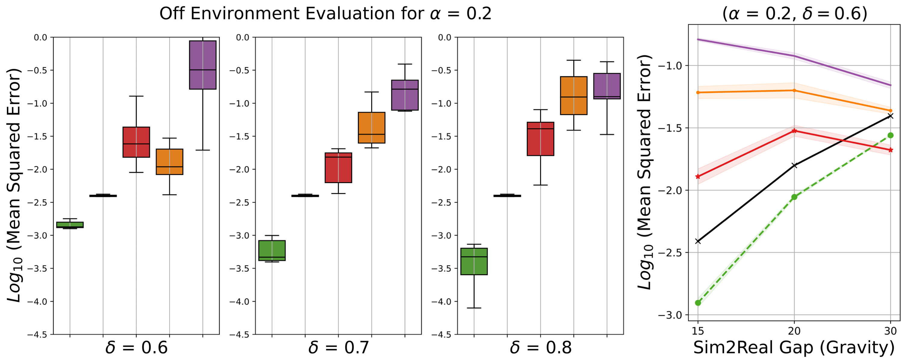
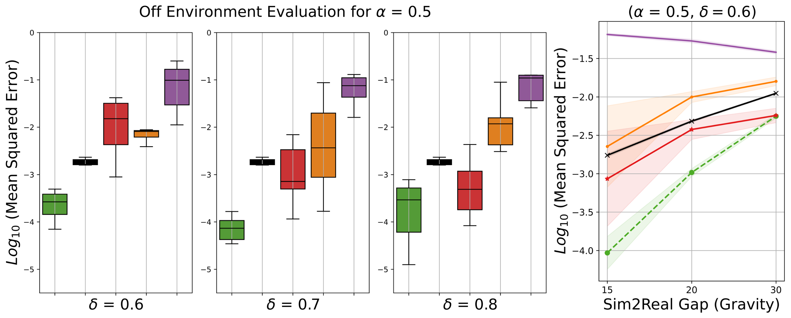
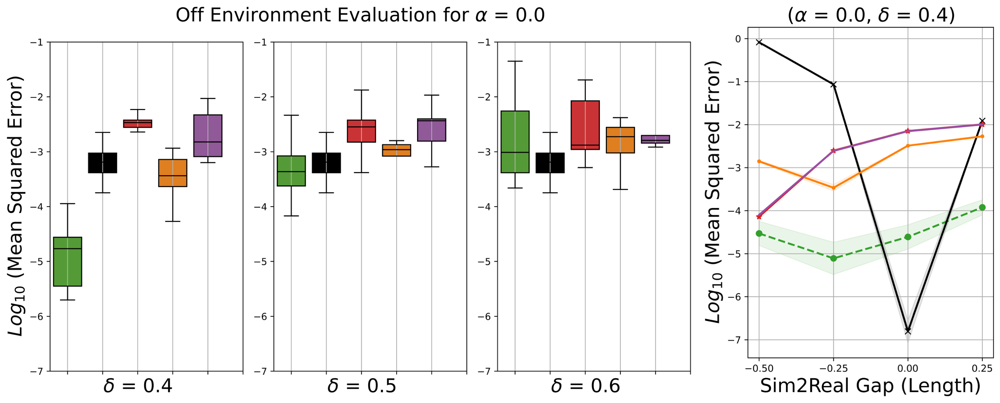
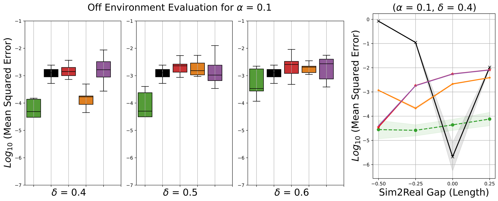
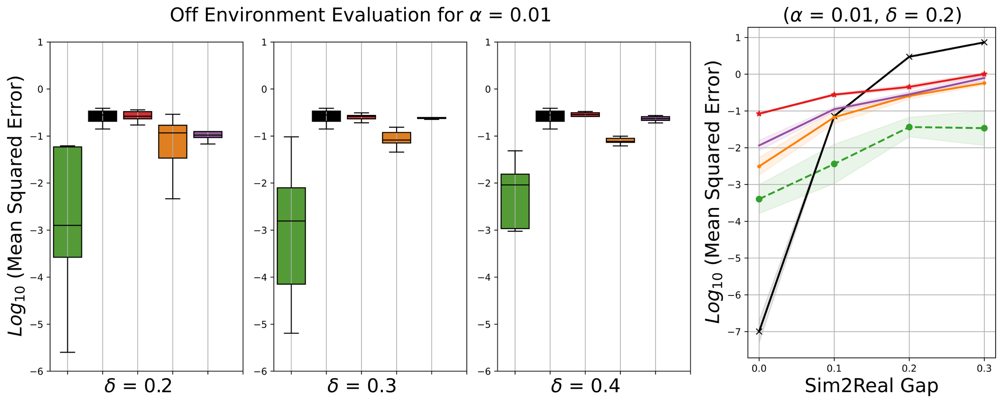
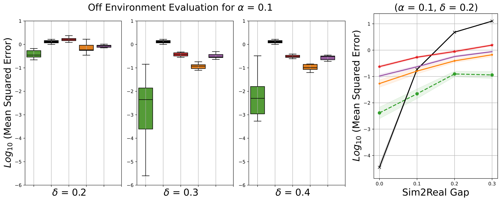

# Marginalized Importance Sampling for Off-Environment Policy Evaluation
This is the code implementation of our CoRL 2023 submission **Marginalized Importance Sampling for Off Environment Policy Evaluation**

## Abstract
Reinforcement Learning (RL) methods are typically sample-inefficient, making it challenging to use them in robotics. Even a robust policy trained in simulator, requires careful finetuning in order to deploy them on the real-world environment. This paper proposes a new approach to evaluate the real-world performance of agent policies. The proposed approach leverages a simulator along with any offline data to evaluate the performance of any policy using the framework of off-Marginalized Importance Sampling (MIS) methods. Existing MIS methods face two challenges: (1) large density ratios that deviate from a reasonable range and (2) indirect supervision, where the ratio needs to be inferred indirectly. Our approach addresses these challenges by introducing the target policy's occupancy in the simulator as an intermediate variable and learning the density ratio as the product of two terms that can be learned separately. The first term has direct supervision and the second term has a small magnitude (i.e., close to 1). The sample complexity and error propagation are analyzed. We empirically evaluate our approach on Sim2Sim environments such as Cartpole, Reacher and Half-Cheetah. We show that our method generalizes well across a variety of Sim2Sim gap, Target policies and offline data collection policies. We also validate the performance of a linear policy on 7 DOF robotic arm using noisy offline data along with a gazebo based arm simulator.

# Installation Instructions
Most of our experiments were tried and tested on Python 3.7.13 on an Ubuntu OS. We recommend installing [anaconda](https://docs.anaconda.com/free/anaconda/install/index.html) environment.

```
# After installing Anaconda
conda create --name mis_oee python=3.7
conda activate mis_oee 
```
Additionally install the following dependencies. 

1. [stable-baselines3](https://github.com/DLR-RM/stable-baselines3)
```
# Try the following command
pip install stable-baselines3
# if this does not work, follow instructions https://github.com/DLR-RM/stable-baselines3
```
2. [rl-baselines-zoo ](https://github.com/DLR-RM/rl-baselines3-zoo)
```
git clone https://github.com/DLR-RM/rl-baselines3-zoo.git
cd rl_baselines3_zoo 
pip install -e.
```
3. [GradientDICE](https://github.com/ShangtongZhang/DeepRL/tree/GradientDICE/deep_rl)
```
git clone https://github.com/ShangtongZhang/DeepRL/tree/GradientDICE/deep_rl.git
pip install -r requirements.txt
```
Additionally to run experiments on HalfCheetah, you need to install [Roboschool](https://github.com/openai/roboschool). 
We also used [Sunblaze](https://github.com/sunblaze-ucb/rl-generalization) environments for HalfCheetah to create different Sim2Sim scenarios

# Instructions for Running Code 
We provide code for Sim2Sim experiments in this code release. For the Sim2Sim experiments, we first need to train an optimal policy. 
## Learn a Pre-trained Policy 
```
python train.py --algo ppo --env EnvName 
# EnvName: RoboSchoolReacher-v1, RoboschoolHalfCheetah-v1, Cartpole-v1
```
You can ideally try other algorithms too, but the released code is transformed from PPO. The experiment creates a ```logs``` folder with the a directory named after the training algorithm. The trained policies are saved in that directory. 

You can similarly, train a policy for the taxi environment as follows, 
```
python q_learning_taxi.py
```

## Data Collection 

To run data collection pipeline for **HalfCheetah, Reacher**. Run the following

```
alpha=0.1
python enjoy.py --env-kwargs "env_id:1" --algo ppo --env RoboschoolReacher-v1 -f logs/ --exp-id 1 --load-best --save_file 'offline_data/sim_world_data' --timesteps 1000 -n 100000 --alpha $alpha # On-Policy Sim data
# Collect Real World data 
delta=0.4
python enjoy.py --env-kwargs "env_id:1" --algo ppo --env RoboschoolReacher-v1 -f logs/ --exp-id 1 --load-best --save_file 'offline_data/real_world_data' --timesteps 1000 -n 100000 --policy_noise $delta # Real world data 
```
To run data collection pipeline for **Taxi**. Run the following
```
# Simulator Environment
alpha=0.01
python enjoy_taxi.py --save_file 'real_world_data' --transition_probability 0.0 --policy_noise $alpha

# Real Environment
params_p=0.1 # sim2sim gap 
delta=0.2 
python enjoy_taxi.py --save_file 'sim_world_data' --transition_probability $params_p --policy_noise $delta
```

## Off Environment Evaluation
Off Environment Evaluation for Reacher, HalfCheetah
```
delta=0.4
alpha=0.1
params_p=0.1 #Sim2Sim gap
python train_oee_estimator_continous.py --env 'RoboschoolReacher-v1' --exp-id 1 --sim_policy $alpha --real_policy $delta --load-best --algo_type 'Beta-DICE' --index $id --timesteps $steps --params_p $env_id
```
Off Environment Evaluation for Taxi
```
python train_tabular_oee_estimator.py --env 'Taxi-v3' --exp-id 1 --sim_policy $alpha --real_policy $delta --algo_type 'Beta-DICE' --index $id --timesteps $steps --params_p $params_p
```
# Results
## Cartpole 

||
|:-----:|
|LHS: Off Environment Evaluation for Cartpole a fixed $\alpha=0.2$ and changing $\delta=\{0.6, 0.7, 0.8\}$, RHS: Effect of Off Environment with varying Sim2Real gap with fixed $\alpha=0.2,\delta=0.6$

||
|:-----:|
|LHS: Off Environment Evaluation for Cartpole a fixed $\alpha=0.5$ and changing $\delta=\{0.6, 0.7, 0.8\}$ RHS: Effect of Off Environment with varying Sim2Real gap with fixed $\alpha=0.5, \delta=0.6$

||
|:-----:|
|Off Environment Evaluation for Cartpole a fixed $\alpha=0.8$ and changing $\delta=\{0.6, 0.7, 0.8\}$ 
## Reacher 

||
|:-----:|
|LHS: Off Environment Evaluation for Reacher a fixed $\alpha=0.0$ and changing $\delta=\{0.4, 0.5, 0.6\}$, RHS: Effect of Off Environment with varying Sim2Real gap with fixed $\alpha=0.0,\delta=0.4$

||
|:-----:|
|LHS: Off Environment Evaluation for Reacher a fixed $\alpha=0.1$ and changing $\delta=\{0.4, 0.5, 0.6\}$ RHS: Effect of Off Environment with varying Sim2Real gap with fixed $\alpha=0.1, \delta=0.4$

||
|:-----:|
|Off Environment Evaluation for Taxi a fixed $\alpha=0.8$ and changing $\delta=\{0.6, 0.7, 0.8\}$ 


## HalfCheetah

||
|:-----:|
|Off Environment Evaluation for HalfCheetah a fixed $\alpha=0.0$ and changing $\delta=\{0.4, 0.5, 0.6\}$ 

||
|:-----:|
|Off Environment Evaluation for HalfCheetah a fixed $\alpha=0.2$ and changing $\delta=\{0.4, 0.5, 0.6\}$ 

||
|:-----:|
|Off Environment Evaluation for HalfCheetah a fixed $\alpha=0.0$ and changing $\delta=\{0.4, 0.5, 0.6\}$ 
## Taxi 
||
|:-----:|
|LHS: Off Environment Evaluation for Taxi a fixed $\alpha=0.01$ and changing $\delta=\{0.2, 0.3, 0.4\}$ RHS: Effect of Off Environment with varying Sim2Real gap with fixed $\alpha=0.01, \delta=0.2$

||
|:-----:|
|LHS: Off Environment Evaluation for Taxi a fixed $\alpha=0.1$ and changing $\delta=\{0.2, 0.3, 0.4\}$ RHS: Effect of Off Environment with varying Sim2Real gap with fixed $\alpha=0.1, \delta=0.2$

||
|:-----:|
|Off Environment Evaluation for Taxi a fixed $\alpha=0.2$ and changing $\delta=\{0.2, 0.3, 0.4\}$ 